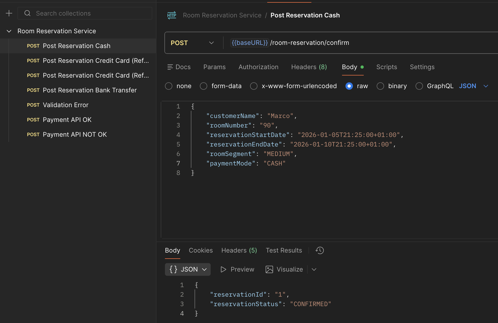
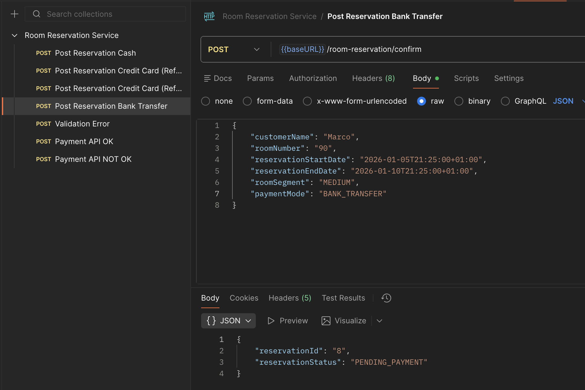
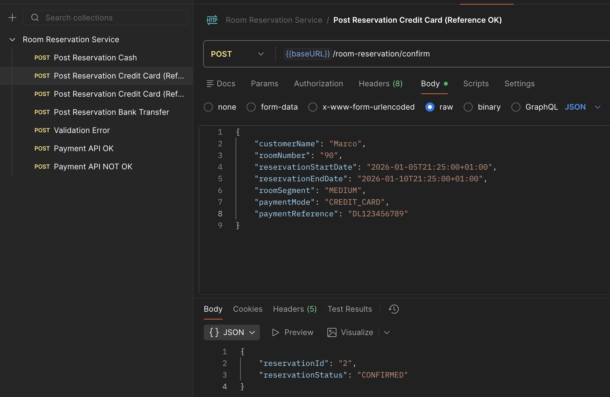
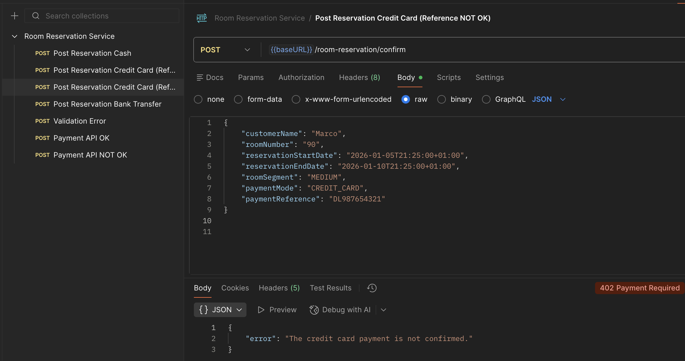
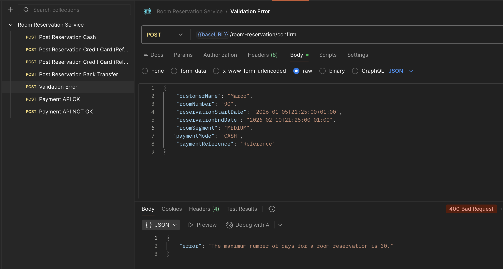
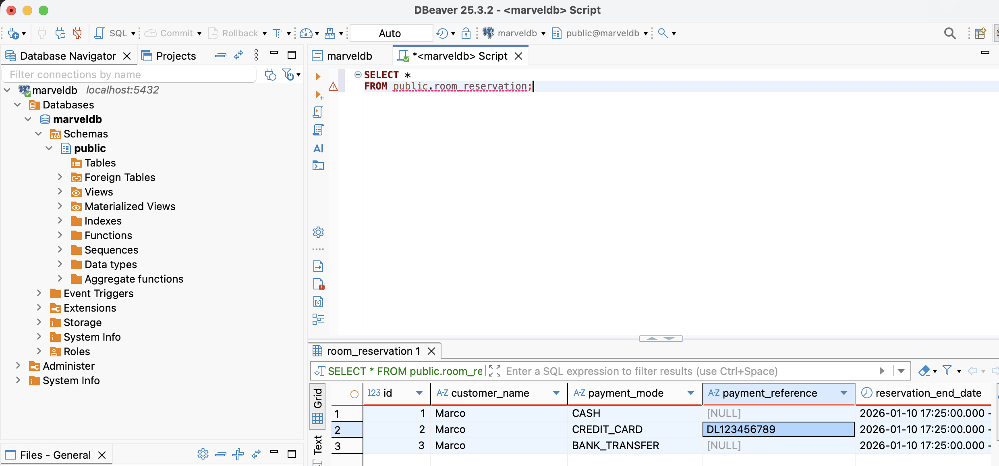

# Room Reservation Service

This is a microservice that is responsible for processing the requests to confirm the reservation of a room.

It has two entrypoints, a http responsible for confirm the room reservation and a Kafka consumer that consumes the bank transfer update messages.

## Architecture

The architeture used in this project is highly inspired by the hexagonal archtecture, with all the layers of the application well segregated with each one having its only function.

The main folders are as follows:

- adapter
  - Responsible for the points of entrance (such as HTTP and Kafka) and exit (such as the database and HTTP endpoints) of the application.
- config
  - Basic spring configurations and beans.
- domain
  - All the classes that are common to all the layers of the applications, such as dto's, exceptions and enums.
- port
  - Package that contains all the interfaces that binds together all the layers of the application, no layer can comunicate with another withou a port.
- usecases
  - The business logic of the microservice, each usecase has a long and explicity name explaining what it does.

## Technologies

- Java 17
- Spring boot 4.0.1
- Postgres 16
- Kafka and Zookeeper
- Docker compose for all the other services that the app needs to run
- Open feign for http requests
- Node.js to mock the payment service endpoint

## The microservice in action

Here are a few screenshots showing the microservice working as intended.

### Room reservation using cash

### Room reservation using bank transfer

### Room reservation using credit card with the payment completed

### Room reservation using credit card with the payment refused

### Validation error because the reservation days is more than 30

### The rows in the database

## Things that I wish I had done

- In the Kafka consumer, it would be great to have a custom deserializer, removing the necessity of consuming an string and then convert it to a Java DTO.
- Refine all the classes names and standardize all of them to be equal through the application.
- Insert the bank transfer payment update variables in the reservation table, but I end up only treating the Kafka event as a success in the payment.
- Create a custom error handler for all the exceptions, making all of the the HTTP error messages friendly for the client calling the application. 

## Conclusion
It was a very fun and demanding assigment to do, I could put in practice all the knoledge that I've been learning and applying through my career as a software engineer.